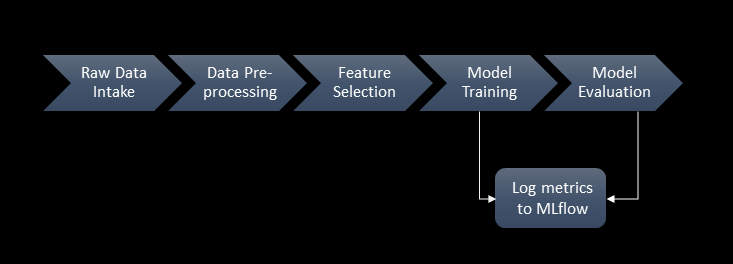

# 🚗 Used Car Price Prediction - Training Environment

This repository is a training environment for building a Machine Learning regression pipeline using the **Used Car Price Dataset**. The pipeline includes preprocessing, feature selection, model training, evaluation, and experiment tracking using tools like Hydra, DVC, and MLflow.

---

## 📁 Project Structure

Used_Car_Price_Prediction/model_training/

├── config/ # YAML-based configuration files
│ ├── config.yaml
│ ├── paths.yaml
│ ├── preprocessing.yaml
│ ├── training.yaml
│ ├── evaluation.yaml
│ └── feature_selection.yaml
│
├── data/ # Raw and processed data files
│ └── used_car_price_dataset_extended.csv
│ └── processed
|
├── models/ # Trained model output
│
├── metrics.json # Evaluation results
|
├── plots # Visualization pots
|
├── notebooks # Jupyter notebooks for initial EDA and AutoML
│
├── src/
│ ├── data_preprocessing.py
│ ├── training.py
│ ├── evaluation.py
│ └── utils.py
│
├── dvc.yaml # DVC pipeline
├── params.yaml # DVC parameters
├── requirements.txt
|── assets/
│   └── images/
│       └── pipeline_diagram.png
├── Makefile
└── README.md

## 🔁 ML Pipeline Flow

## 🧩 Key Tools & Concepts

- **Linear Regression**: Primary model selected via PyCaret AutoML.
- **Feature Engineering**: Null handling, ordinal & one-hot encoding, new features created.
- **Feature Selection**: RFECV with 'LinearRegression' as the estimator.
- **Experiment Tracking**: MLflow to log metrics, models, and parameters.
- **Configuration Management**: Hydra for modular YAML-driven configs.
- **Version Control for Data/Models**: DVC used to track data and model artifacts.
- **Modular Code**: All major tasks separated into scripts with reusable functions.

---

## 📝 Notes

- This is the **training environment** only. A production-ready setup can be added with FastAPI, Docker, CI/CD via GitHub Actions, etc.
- You can run steps via:
  - 'make preprocess'
  - 'make train'
  - 'make evaluate'
- Make sure MLflow server is running ('mlflow ui'), and DVC is initialized and set up ('dvc init').

---